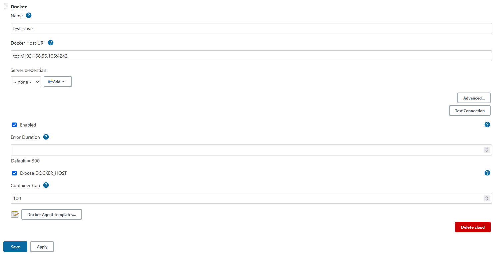
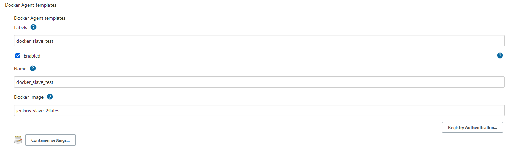
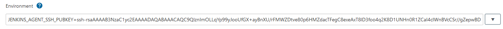
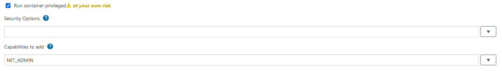
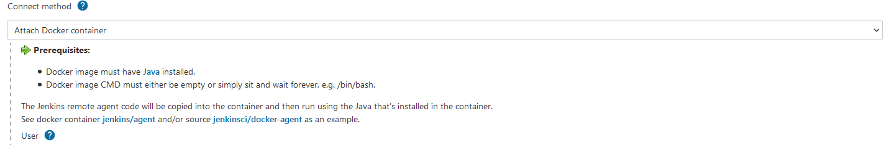
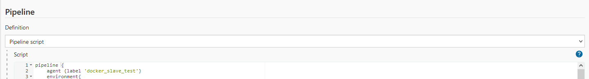

## Create Docker in Docker Jenkins slave ssh agent
On host with installed Docker need enable remote API:  
* make changes for Docker service in file `/etc/systemd/system/docker.service`
    ```angular2html
    ExecStart=/usr/bin/dockerd -H tcp://0.0.0.0:4243 -H unix:///var/run/docker.sock
    ```
* restart Docker service
    ```angular2html
    $ sudo systemctl daemon-reload
    $ sudo systemctl restart docker
    ```
* check Docker from remote host
    ```angular2html
    $ curl http://192.168.56.105:4243/version    
    ```
  replace IP address on your host IP  
  If all ok, you should see output, something like that:
  ```angular2html
  {"Platform":{"Name":"Docker Engine - Community"},"Components":[{"Name":  
  "Engine","Version":"20.10.7","Details":{"ApiVersion":"1.41","Arch":"amd64",  
  "BuildTime":"2021-06-02T11:54:50.000000000+00:00","Experimental":"false",  
  "GitCommit":"b0f5bc3","GoVersion":"go1.13.15","KernelVersion":"5.4.0-77-generic",  
  "MinAPIVersion":"1.12","Os":"linux"}},{"Name":"containerd","Version":  
  "1.4.6","Details":{"GitCommit":"d71fcd7d8303cbf684402823e425e9dd2e99285d"}},  
  {"Name":"runc","Version":"1.0.0-rc95","Details":{"GitCommit":"b9ee9c6314599  
  f1b4a7f497e1f1f856fe433d3b7"}},{"Name":"docker-init","Version":"0.19.0",  
  "Details":{"GitCommit":"de40ad0"}}],"Version":"20.10.7","ApiVersion":"1.41",  
  "MinAPIVersion":"1.12","GitCommit":"b0f5bc3","GoVersion":"go1.13.15",  
  "Os":"linux","Arch":"amd64","KernelVersion":"5.4.0-77-generic","BuildTime":  
  "2021-06-02T11:54:50.000000000+00:00"}  
  ```
Build a Docker image from Dockerfile:
```angular2html
$ docker build -t jenkins_slave_2 .
```
name could be yours

On Jenkins master goto **Manage Jenkins->Manage Nodes and Clouds->Configure Clouds**  
and click *Add new Cloud->Docker*. Input the name of cloud and click *Docker Cloud details*  
 
fill *Docker Host URI*(IP from Docker host, see above), check *Enabled* and *Expose DOCKER_HOST*  

After that click *Docker Agent templates...*  

fill *Labels*, *Name* (optionally), *Docker image* (name a build image, see above) and check *Enabled*  

Click *Container settings*: 

pass a public ssh key for agent

check *Run container privileged* and in *Capabilities to add* pass *NET_ADMIN*

*Connect method* choose *Attach Docker Container* and click **Save**

Now you can use this agent for build(for example in pipeline):

