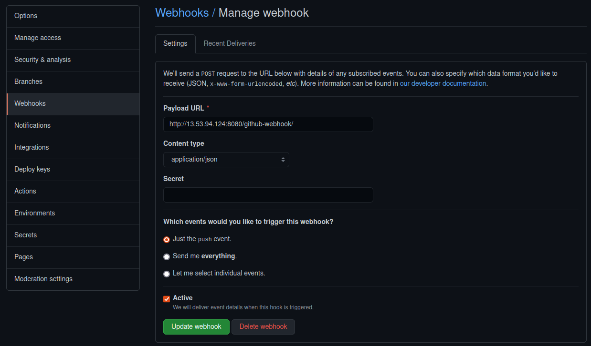
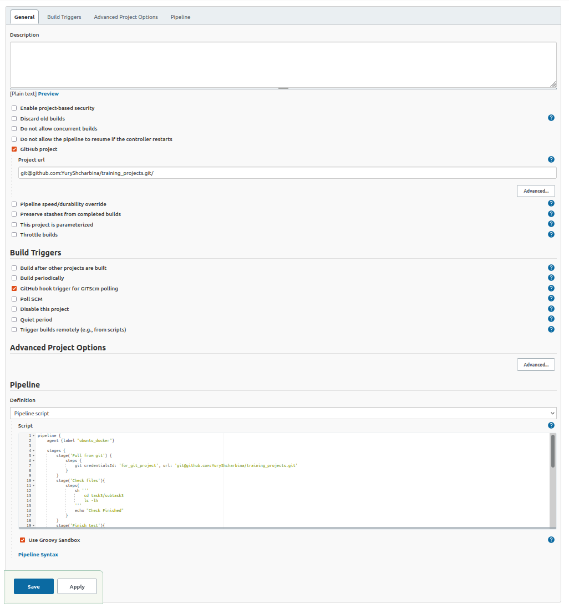

### Subtask1
Pipeline from *Jenkinfile_1_extra* runs container on remote build agent,  
from Dockerfile pulled from Github

### Subtask2
In *install_jenkins* folder ansible roles for install Jenkins in Docker container

### Subtask3
Pipeline from *Jenkins_3_extra* create local registry on remote build agent,  
pull image from Dockerhub, push it to the local registry and start docker container from this image

### Subtask4
For this task used *Git Hub* Jenkins plugin.  
On Github repository created webhook for this job **Settings->Webhooks**:

In pipeline settings added two options-*Github project* and *Build Triggers*:
