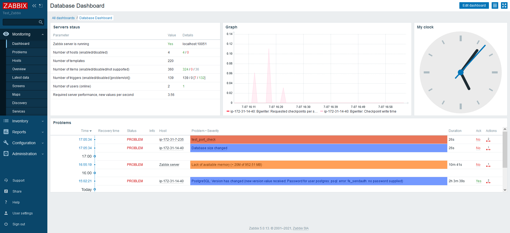
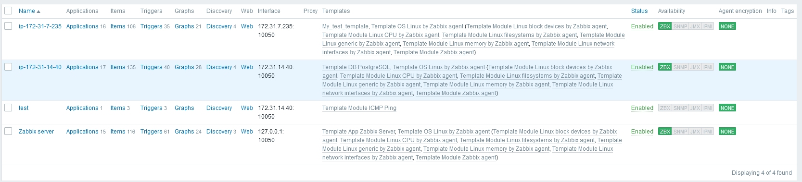

## Working with Zabbix
### Install Zabbix agent
For installing agents created ansible role in folder *zabbix agent install*
###Custom dashboards
The first:
 
The second with map:

### Fired triggers

### Active and passive checks
Created *My_test_template* with two items with type *Zabbix agent(active)*:

for checking port 5432

for collecting software for inventory

In *Template DB PostgreSQL* created item with type *Zabbix agent*(passive mode):

for check *test_students* database size
### Non agent check
Added host with name *test* and template *	Template Module ICMP Ping*:

and check with ICMP ping:

###Alert with maintenance instruction
In *My_test_template* creater trigger *test_port_check*

with url with instruction and created  action *Report to me*

When action fired on dashboard we have the message with link to instruction

if click link will open the document with necessary actions

