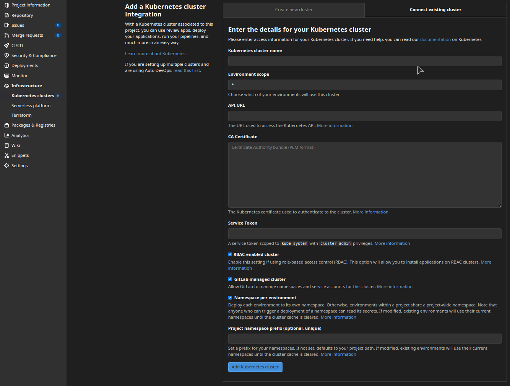

## Kubernetes infrastructure
### Creating cluster
For deploy you need to create Kubernetes Cluster. In this project used Google cloud GKE.  
First need to create cluster follow the [instruction](https://cloud.google.com/kubernetes-engine/docs/how-to/creating-a-zonal-cluster).  

Next we need add cluster to gitlab. In Gitlab go to **Infrastructure->Kubernetes clusters->Connect cluster with certificate**  
Choose **Connect existing cluster->Google GKE**

Now we need fill in the details:
* *Kubernetes cluster name* - the name of GKE cluster created above  
* *API URL* - can obtain in GCP in GKE clusters, or you can start in GCP cloud shell and run command:  
    ```shell
        $ kubectl cluster-info | grep 'Kubernetes control plane' | awk '/http/ {print $NF}'
          https://xxx.xxx.xxx.xxx
    ```  
    output paste in API URL field in Gitlab form
* *CA Certificate* - in cloud shell run commands:
    ```shell
        $ kubectl get secrets
          NAME                  TYPE                                  DATA   AGE
          default-token-xxxx  kubernetes.io/service-account-token   3      4h30m
        $ kubectl get secret default-token-xxxx -o jsonpath="{['data']['ca\.crt']}" | base64 --decode
          -----BEGIN CERTIFICATE-----
          MIIDKjCCAhKgAwIBAgIQYodOX2DvNR79ldRtjj3DODANBgkqhkiG9w0BAQsFADAv
          .....
          gkgCqFexU8zcN81g/aQ+ICbb45w53smHp7oXZNSu2TYYeaYlVYEHLApVlSygGA==
          -----END CERTIFICATE-----
    ```
    output paste in CA Certificate field in Gitlab form
* *Service Token* in cloud sheel:
    * create a file called, for example, gitlab-admin-service-account.yaml with contents:  
        ```yaml
            apiVersion: v1
            kind: ServiceAccount
            metadata:
              name: gitlab
              namespace: kube-system
            
            ---
            apiVersion: rbac.authorization.k8s.io/v1
            kind: ClusterRoleBinding
            metadata:
              name: gitlab-admin
            roleRef:
              apiGroup: rbac.authorization.k8s.io
              kind: ClusterRole
              name: cluster-admin
            subjects:
              - kind: ServiceAccount
                name: gitlab
                namespace: kube-system
        ```
    * run command:
        ```shell
            $ kubectl apply -f gitlab-admin-service-account.yaml
              serviceaccount "gitlab" created
              clusterrolebinding "gitlab-admin" created    
        ```
    * run command:
        ```shell
            $ kubectl -n kube-system describe secret $(kubectl -n kube-system get secret | grep gitlab | awk '{print $1}')
              Name:         gitlab-token-mvcfw
              Namespace:    kube-system
              Labels:       <none>
              Annotations:  kubernetes.io/service-account.name: gitlab
                            kubernetes.io/service-account.uid: 17515b8d-58bc-4bdb-9f94-bd90986ced1d

              Type:  kubernetes.io/service-account-token

              Data
              ====
              ca.crt:     1159 bytes
              namespace:  11 bytes
              token:      eyJhbGciOiJSUzI1NiIsImtpZCI6IkN4czY0Q3ZZZkUxLTA0dW5sRVliN1pWeUxMTFI4NHR6YTI5R3ZvbHV0YmMifQ.  
              eyJpc3 ... 
              ...
              1bnQvc2VjcmV0Lm5hbWUiOiJnaXRsYWItdG9rZW4tbXZjZnciLCJrdWJlcm5ldGVzLmlvL3NlcnZpY2VhY2NvdW50L3ywQFjL0fLQg
        ```
        copy token value and paste it in Service Token field in Gitlab form
* And finally click **Add Kubernetes Cluster**  

After that we need add environment variables for CI/CD pipeline to work with this kluster:  
Go to **Settings->CI/CD** and expand **Variables**.Then add threes variables(names of variables can be different):  
* `KUBE_CA` - certificate for GKE, but now it should be encrypted:
in cloud shell run command:
    ```shell
      $ kubectl get secret default-token-xxxx -o jsonpath="{['data']['ca\.crt']}"
        LS0tLS1CRUdJTiBDRVJUSUZJQ0FURS0tLS0tCk1JSURLakNDQWhLZ0F3SUJBZ0lRWW9kT1gyRHZOUjc5bGRSdGpqM0RPREFOQmdrcWhraUc5d
        ....
        lFSExBcFZsU3lnR0E9PQotLS0tLUVORCBDRVJUSUZJQ0FURS0tLS0tCg== 
    ```
    output paste in value field in Gitlab form
* `KUBE_TOKEN` - token for user gitlab in GKE(see above)
* `KUBE_URL` - API URL for GKE(see above)

### Add secretes to cluster
For proper work with kubernetes we need add some secrets:
* for work with Gitlab docker registry:  
    ```shell
    $ kubectl create secret docker-registry <secret name> --docker-server=https://registry.gitlab.com \  
      --docker-username=<gitlab username> --docker-password=<gitlab user password> --docker-email=<gitlab user e-mail>
    ```
* for work with GCS bucket create Google service account see [Creating and managing service account keys](https://cloud.google.com/iam/docs/creating-managing-service-account-keys)  
  after that, when you have your key in json format just add it to kubernetes:
  ```shell
  $   kubectl create secret generic <name of secret> --from-file=<name of key file>=<service key.json>
  ```


