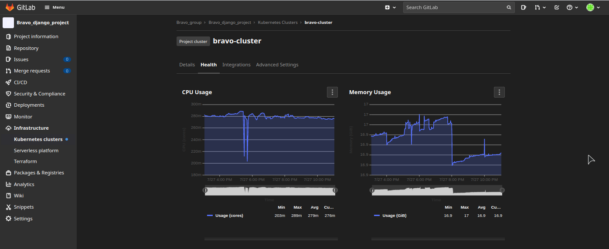
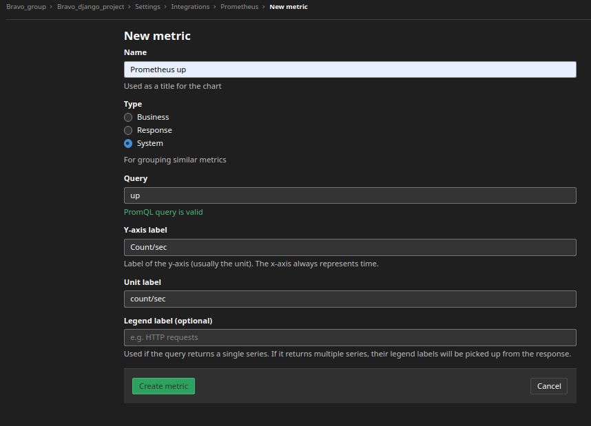
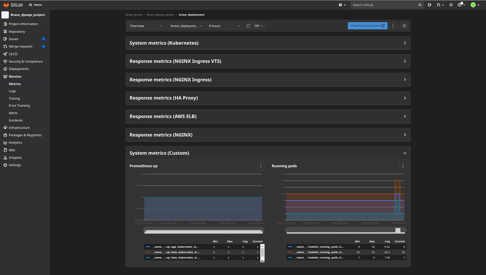

## Monitoring in project
### Integration Kubernetes clusters in Gitlab with Prometheus
On Gitlab go to **Infrastructure->Kubernetes clusters** and select cluster you need. On the next page click **Integrations**, check
*Enable Prometheus integration* and click **Save changes**.  
Then you need install Prometheus in your cluster,for example:
```shell
$ kubectl create ns gitlab-managed-apps
$ wget https://gitlab.com/gitlab-org/project-templates/cluster-management/-/raw/master/applications/prometheus/values.yaml
$ helm repo add prometheus-community https://prometheus-community.github.io/helm-charts
$ helm install prometheus prometheus-community/prometheus -n gitlab-managed-apps --values values.yaml
```
After install go to *Health* tab and after a while you should see Prometheus information from cluster:
  

### Configure additional metrics
To add metrics from Prometheus in kubernetes cluster go to 
**Settings->Integrations->Prometheus**. In **Metrics** click *New metric*
and fill the form, for example:
  
and click *Create metric*.   

Now this metrics appeared in **Monitor->Metrics** in section *System metrics(Custom)*:  


